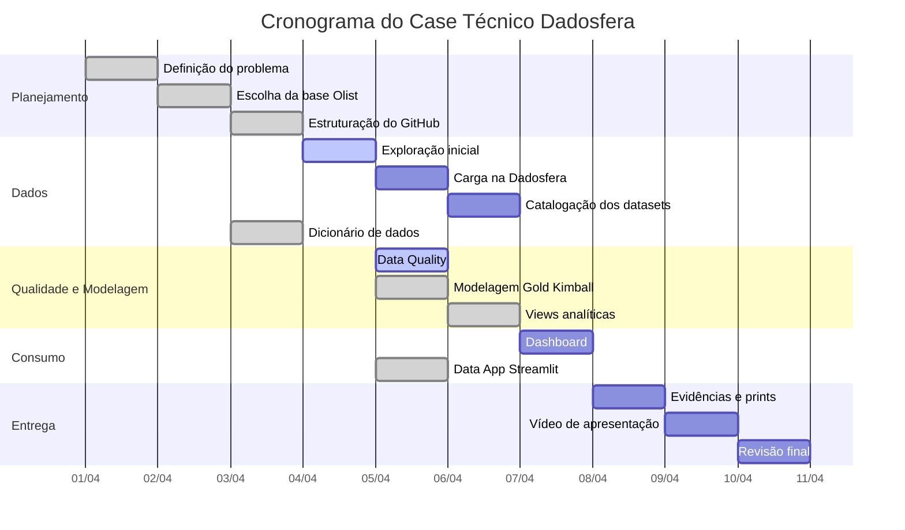

# Planejamento do Projeto - Gantt

## 1. Objetivo

Este documento apresenta o planejamento macro do projeto desenvolvido para o case técnico da Dadosfera.

O objetivo do planejamento é organizar as etapas de execução, dependências, entregáveis e status das atividades necessárias para construção da solução de dados.

---

## 2. Escopo do Projeto

O projeto contempla a construção de uma solução de dados para análise de e-commerce utilizando a base pública da Olist.

O escopo inclui:

- escolha da base de dados;
- estruturação do repositório GitHub;
- documentação da arquitetura;
- exploração inicial dos dados;
- carga dos dados na Dadosfera;
- catalogação dos datasets;
- criação de dicionário de dados;
- execução de Data Quality;
- modelagem dimensional;
- criação de views analíticas;
- construção de dashboard;
- criação de Data App;
- gravação de apresentação final.

---

## 3. Cronograma Macro

| Fase | Atividade | Duração Estimada | Dependência | Entregável | Status |
|---|---|---:|---|---|---|
| 1 | Definição do problema de negócio | 1 dia | Nenhuma | README inicial | Concluído |
| 2 | Escolha da base Olist | 1 dia | Fase 1 | Documento de download | Concluído |
| 3 | Estruturação do GitHub | 1 dia | Fase 1 | Repositório estruturado | Concluído |
| 4 | Exploração inicial dos dados | 1 dia | Fase 2 | Relatório de exploração | Em andamento |
| 5 | Carga dos dados na Dadosfera | 1 dia | Fase 2 | Datasets carregados | Pendente |
| 6 | Catalogação dos datasets | 1 dia | Fase 5 | Datasets catalogados | Pendente |
| 7 | Dicionário de dados | 1 dia | Fase 2 | `data/dicionario_dados_olist.md` | Concluído |
| 8 | Data Quality | 1 dia | Fase 4 | Relatório Great Expectations | Em andamento |
| 9 | Modelagem Gold Kimball | 1 dia | Fase 4 | SQLs Gold | Concluído |
| 10 | Views analíticas | 1 dia | Fase 9 | Views comerciais e experiência | Concluído |
| 11 | Dashboard | 1 dia | Fase 10 | Dashboard com 5+ visualizações | Pendente |
| 12 | Data App Streamlit | 1 dia | Fase 4 | App interativo | Concluído |
| 13 | Evidências e prints | 1 dia | Fases 5, 8, 11, 12 | Pasta `evidencias/` | Pendente |
| 14 | Vídeo de apresentação | 1 dia | Fases 11, 12, 13 | Vídeo YouTube não listado | Pendente |
| 15 | Revisão final | 1 dia | Todas as fases | Entrega final | Pendente |

---

## 4. Visualização em Mermaid Gantt

---

## 5. Dependências Principais

| Dependência | Impacto |
|---|---|
| Download da base Olist | Necessário para exploração, qualidade, Data App e carga |
| Acesso à Dadosfera | Necessário para carga, catálogo, pipeline e dashboard |
| Execução dos scripts Python | Necessário para relatórios e validações |
| Criação das views Gold | Necessário para dashboard e análises finais |
| Dashboard na Dadosfera | Necessário para evidências visuais |
| Vídeo no YouTube | Necessário para apresentação final |

---

## 6. Entregáveis por Fase

### Planejamento

- `README.md`
- `planejamento/gantt.md`
- `planejamento/riscos_custos_recursos.md`
- `planejamento/kanban.md`

### Dados

- `data/instrucoes_download_olist.md`
- `data/dicionario_dados_olist.md`
- `notebooks/01_exploracao_olist.py`
- `data_quality/reports/resumo_exploracao_olist.md`

### Qualidade

- `data_quality/great_expectations_olist.py`
- `data_quality/reports/relatorio_data_quality_olist.md`
- `data_quality/reports/resultado_data_quality_olist.json`

### Modelagem

- `sql/gold/dim_cliente.sql`
- `sql/gold/dim_produto.sql`
- `sql/gold/dim_vendedor.sql`
- `sql/gold/dim_tempo.sql`
- `sql/gold/fato_pedidos.sql`
- `sql/gold/fato_pagamentos.sql`
- `sql/gold/fato_reviews.sql`
- `sql/gold/vw_ecommerce_performance_comercial.sql`
- `sql/gold/vw_ecommerce_experiencia_cliente.sql`

### Consumo

- `apresentacao/planejamento_dashboard.md`
- `streamlit_app/app.py`
- `streamlit_app/README.md`

### Evidências

- `evidencias/checklist_evidencias.md`
- prints dos datasets
- prints do catálogo
- prints do dashboard
- prints do relatório de qualidade
- prints do Data App

### Apresentação

- `apresentacao/roteiro_video.md`
- link do vídeo no YouTube como não listado

---

## 7. Status Geral

| Área | Status |
|---|---|
| Planejamento | Em andamento |
| Documentação | Em andamento |
| Exploração dos dados | Em andamento |
| Data Quality | Em andamento |
| Modelagem | Concluído parcialmente |
| Dashboard | Pendente |
| Data App | Criado |
| Evidências | Pendente |
| Vídeo | Pendente |
| Entrega final | Pendente |

---

## 8. Conclusão

O planejamento foi estruturado para priorizar primeiro os itens obrigatórios do case e, em seguida, evoluir para entregas mais avançadas, como Data App, roteiro de apresentação e evidências complementares.

Esse controle permite acompanhar o progresso da entrega, reduzir riscos e garantir que todos os critérios do case sejam atendidos.